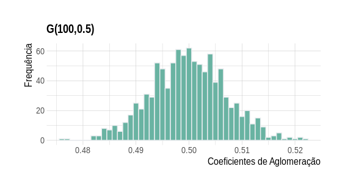
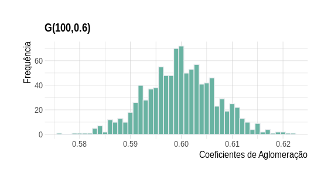
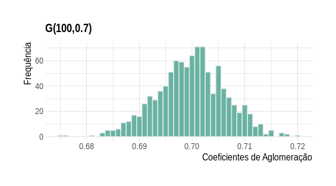
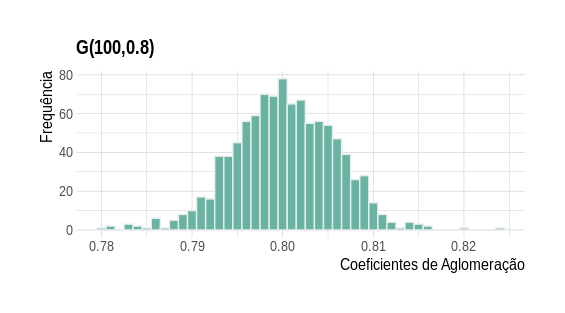
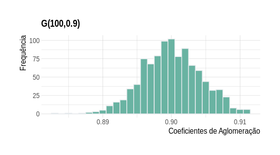

1- Simulação de $G(N, p)$

Para esta simulação foram utilizados os seguintes parâmetros $N = 100$ e $p = \{0.5, 0.6, 0.7, 0.8, 0.9\}$, cada configuração de $G(N, p)$ foram replicadas $R = 1000$ vezes. Ao final de cada simulação foram calculados os coeficientes de aglomeração e seus histogramas.

```{r echo=TRUE}
load(file = "Coeficientes de Aglomeracao.Rdata")
head(Ca)
```


```{r echo=FALSE}

```

```{r echo=FALSE}

```

```{r echo=FALSE}

```

```{r echo=FALSE}

```

```{r echo=FALSE}

```


```{r echo=FALSE, eval=FALSE}

library(tidyverse)
library(hrbrthemes)

load(file = "Coeficientes de Aglomeracao.Rdata")
ggplot(data=Ca, aes(x=`p=0.5`))+
geom_histogram(binwidth=0.001, fill="#69b3a2", color="#e9ecef") +
ggtitle("G(100,0.5)") + 
  xlab("Coeficientes de Aglomeração") + 
  ylab("Frequência") +
 theme_ipsum() +
theme(plot.title = element_text(size=15), axis.title.x=element_text(size=13),
     axis.title.y=element_text(size=13))


```

\newpage

### Códigos

```{r echo=TRUE, eval=FALSE}

##### G(N,p) Model #####
gnp_model<-function(n,p){
  M <- matrix(0, ncol = n, nrow = n)
  for(i in 1:n){
    for(j in 1:i){
      if(runif(1) <= p){
        M[i,j] <- 1
      } else{
        M[i,j] <- 0
      }
    }
  }
  M
}

```

```{r echo=TRUE, eval=FALSE}

library(igraph)
library(tidyverse)

N <- 100 # numero de vertices 
p <- c(0.5,0.6,0.7,0.8,0.9) # probabilidades utilizadas para gerar os grafos
R <- 1000 # numero de replicas 

Ca <- tibble(         # matriz que guardará todos os coeficientes de algomeração
  "p=0.5" = rep(0, R),
  "p=0.6" =rep(0, R),
  "p=0.7" = rep(0, R),
  "p=0.8" = rep(0, R),
  "p=0.9" = rep(0, R),
)

# Simulação 
for(j in 1:length(p)){
grafos <- list()
coef_agl <- c()
  for(i in 1:R){
  set.seed(i*j+1234)
  grafos[[i]] <- gnp_model(N,p[j])  %>% graph_from_adjacency_matrix()
  coef_agl[i] <- transitivity(grafos[[i]], type="localaverage") # calculo do coeficiente
    } 
  Ca[,j] <- coef_agl
}


```

